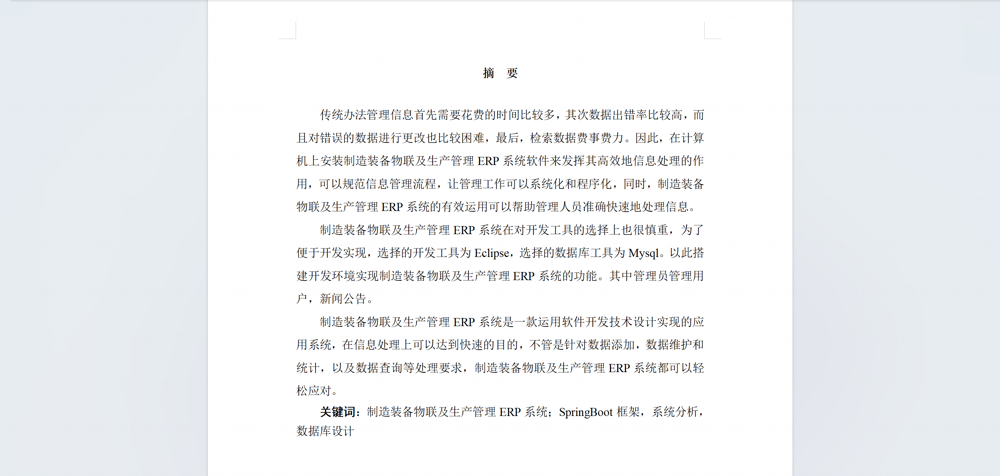

基于Springboot的制造装备物联及生产管理ERP系统（程序+论文）
=

### 完整代码获取地址：从戎源码网 ([https://armycodes.com/](https://armycodes.com/))
### 作者微信：19941326836  QQ：952045282 
### 承接计算机毕业设计、Java毕业设计、Python毕业设计、深度学习、机器学习
### 选题+开题报告+任务书+程序定制+安装调试+论文+答辩ppt 一条龙服务
### 所有选题地址https://github.com/nature924/allProject

一、项目介绍
---

基于SpringBoot+Vue的制造装备物联及生产管理ERP系统，系统角色为管理员、员工、维修员，主要功能如下

管理员：
基本操作：登录、修改密码、获取个人信息、修改个人信息
用户管理：筛选用户、获取用户列表、查看详情、新增用户、修改用户、删除用户
员工管理：筛选员工、获取员工列表、查看员工详情、新增员工、修改员工、删除员工
维修员管理：筛选维修员、获取维修员列表、查看维修员详情、新增维修员、修改维修员、删除维修员
材料管理：筛选材料、获取材料列表、查看材料详情、新增材料、修改材料、删除材料、批量导入
出入库管理：筛选出入库、获取出入库列表、查看详情、新增出库、入库、修改出入库、删除出入库
出入库详情管理：获取出入库明细列表、查看明细详情、删除明细
产品管理：筛选产品、获取产品列表、查看产品详情、新增产品、修改产品、删除产品
顾客订单管理：筛选订单、获取订单列表、查看订单详情、新增订单、修改订单、删除订单
设备管理：筛选设备、获取设备列表、查看设备详情、新增设备、修改设备、删除设备
设备检修管理：筛选检修记录、获取检修列表、查看检修详情、新增检修记录、修改检修记录、删除检修记录
生产计划管理：筛选计划、获取计划列表、查看计划详情、新增计划、修改计划、删除计划
质量监控管理：筛选质量记录、获取记录列表、查看记录详情、新增记录、修改记录、删除记录

员工：
基本操作：登录、修改密码、获取个人信息、修改个人信息
材料管理：筛选材料、获取材料列表、查看材料详情
出入库管理：筛选出入库、获取列表、查看详情、发起出库/入库、查看个人相关记录
出入库详情管理：查看出入库明细列表、查看明细详情
产品管理：筛选产品、获取产品列表、查看产品详情
顾客订单管理：筛选订单、获取订单列表、查看订单详情、新增订单、修改个人订单
设备管理：查看设备列表、查看设备详情
设备检修管理：提交检修申请、查看检修进度与详情
生产计划管理：查看计划列表与详情、按需提交相关信息
质量监控管理：新增质量记录、筛选与查看个人相关记录、修改个人提交记录

维修员：
基本操作：登录、修改密码、获取个人信息、修改个人信息
设备检修管理：接单/处理检修任务、获取检修列表、筛选检修记录、查看检修详情、新增/更新检修处理情况、删除无效记录
材料管理与出入库：查看材料与库存、根据维修需求发起出库/入库、查看个人相关出入库记录与明细
设备管理：查看设备列表、查看设备详情、反馈设备状态
质量监控管理：筛选质量记录、查看详情、按需新增或更新与维修相关质量数据

二、项目技术
---
- 编程语言：Java
- 数据库：MySQL
- 项目架构：B/S架构
- 前端技术：JSP
- 后端技术：Spring、SpringMVC、MyBatis

三、运行环境
---
- 操作系统：Windows、macOS都可以
- JDK版本：JDK1.8以上都可以
- 开发工具：IDEA、Ecplise、Myecplise都可以
- 数据库: MySQL5.7以上都可以
- Tomcat：任意版本都可以
- Maven：任意版本都可以

四、运行截图
---
### 论文截图：

### 程序截图：

